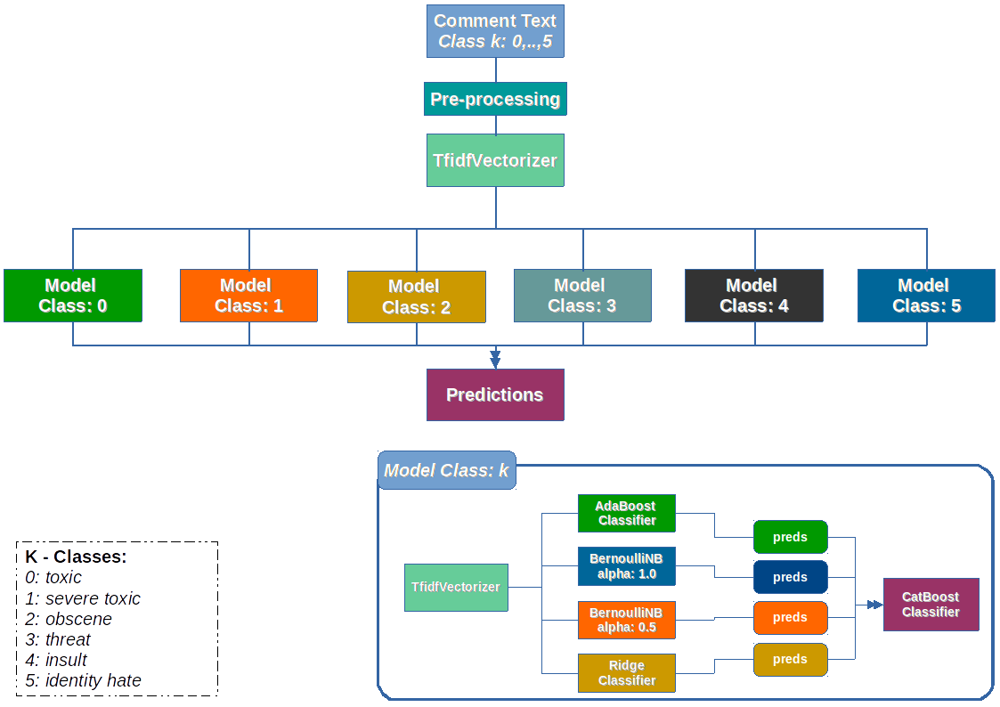

# Introduction
In this repository I am showing the model that I used in the [Toxic Comment Classification Challenge](https://www.kaggle.com/c/jigsaw-toxic-comment-classification-challenge) hosted by kaggle, in this competition, we have to build a multi-headed model that’s capable of detecting different types of of toxicity like threats, obscenity, insults, and identity-based hate. To train the models a dataset of comments from Wikipedia’s talk page edits was available, this data set contains text that may be considered profane, vulgar, or offensive.

# Data set description
The data correspond to comments from Wikipedia’s talk page edits, it can be access from the [competition page](https://www.kaggle.com/c/jigsaw-toxic-comment-classification-challenge). As usual in kaggle competitions, the data is split into training and test sets.
The columns in the training set are as follows:

|Column      | Description                                                       |
|------------|-------------------------------------------------------------------|
|id          | Row id                                                            |
|comment_text| This contains the text that we need to classify                   |
|classes     | There are six columns representing the classes, each one is binary|

In a similar way the test set have the same two first columns of the training set, except the last one.

# Model
To handle this problem I used an ensemble model composed of ensemble models, basically I used four

# Results
At the end of the competition the model obtain a score of 0.9566 in the private leaderboard

__Note:__ To run the model, you need to download this reposiotory, it is necesary to have all the necesary dependencies, they can be found at the begining of the notebook, the data sets can be access from the [competition page](https://www.kaggle.com/c/jigsaw-toxic-comment-classification-challenge), once they are downloaded you need to put them in a folder named __data__ at the same level that the __model__ folder and run the notebook.
