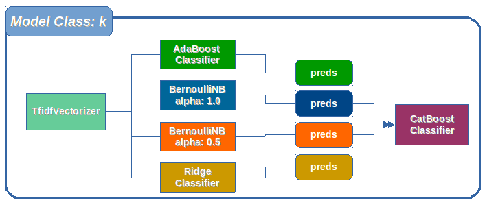

# Introduction

In this repository I am showing the model that I used in the <a href="https://www.kaggle.com/c/jigsaw-toxic-comment-classification-challenge">Toxic Comment Classification Challenge </a> hosted by kaggle, in this competition, we have to build a multi-headed model that’s capable of detecting different types of of toxicity like threats, obscenity, insults, and identity-based hate. To train the models a dataset of comments from Wikipedia’s talk page edits was available, this data set contains text that may be considered profane, vulgar, or offensive.

# Data set description

The data correspond to comments from Wikipedia’s talk page edits, it can be access from the <a href = "https://www.kaggle.com/c/jigsaw-toxic-comment-classification-challenge/data"> competition page </a>. As usual in kaggle competitions, the data is split into training and test sets.

The columns in the training set are as follows:

|Column      | Description                                                       |
|------------|-------------------------------------------------------------------|
|id          | Text id of the row                                                |
|comment_text| This contains the text that we need to classify                   |
|classes     | There are six: toxic, severe toxic, obscene, threat, insult and identity hate|

Each class was represented in a column using binary values. In a similar way the test set contains the same columns, except the classes.

# Model

I extract 5000 TF-IDF features from the text data, then I began experimented with a single model, which did not very well enoght, then I elaborate another idea, since there was six binary clasess corresponding to each category, I decided to use a single classifier which will learn to recognized each one of them, then combine the results into a single model, but it was even worst than the single model, then I decided to create an ensamble model to per class, but before I began to build the model I see that adding more models would result in a more complex training, so I decided to add models which where relativaly simple, and that do not have many hyperparameters to tune (since the data set is relativaly large, it could take many hours to train), that way I ended up with four main models:

- __AdaBoost:__ AdaBoost was prove to have less accuracy, but it achieve aceptable results, also it had no many hyperparameters to tune. Also compared with other tree models it was much faster.
- __BernoulliNB (alpha: 1.0 | alpha: 0.5):__ Surprising, this simple model achieved aceptable results, therefore I decided to add two of them, one using alpha: 1.0 and the other with alpha: 0.5.
- __Ridge Classifier:__ This model was really fast, and it was very accurate too, even more than the other models above.

I obtained decent results, but something was missing, in fact the models described before were not tunned, and that was something that I ironically decide to them to have, but also that means that they can not been more improved, so I decided to add another model inside the enseble, which I will tune, but I also wanted one that have not much hyperparameters to tune, and after trying with many models, I chose CatBoost.

There were two main reasons to chose CatBoost, first when I looked more clossely the data I noticed that the data set was imbalanced, for example, when analized the class thread I found the following:

| Class | Count |
|-------|-------|
|   0   |159093 |
|   1   |478    |

And the pretty well the same was happening with the other five classes, fortunately CatBoost had a hyperparameter to deal with this kind of situations in a binary setting, which is called <b> scale_pos_weight </b>. And the second reasons to chose CatBoost was its simplicity to train, according with their official documentation, they state that CatBoost do not need much hyperparameter tunning, but I decide to give it a try, I used only four hyperparameters: <b> iterations, depth, learning rate and scale pos weight </b>.

After that I was ready to go, something interesting was noticed that the more epoch I gave to catBosst the better were the results, also catBoost do not was affected too much by the lower performance of the other models. You could say that CatBoost was acting like some sort of pipe wrench, controling the results from the others models.

All the above could be summarize in the __Figure 1__:

__Figure 1:__ _Models for class k_

Also, I used the same <b>Figure 1</b> 5000 TF-IDF features to feed all the models. Putting alltogheter we have the final model which is described in the <b> Figure 2</b>:

__Figure 2:__ _Final model_

As you can see, this models made predictions for the <b> k classes </b> which are six in total, inside each block is an ensemble model described in the <b> Figure 2 </b>, all the models add their results, which made the final prediction.

# Reproducibility

To run the model, you need to download this reposiotory, it is necesary to have all the necesary dependencies listed in the table below, the versions have not necessary to be the same, but be aware that some package could not work well with lower versions, also this model was trained in a Ubuntu OS, therefore, you can install all the dependencies from the terminal, the data sets can be access from the <a href = "https://www.kaggle.com/c/jigsaw-toxic-comment-classification-challenge/data"> competition page </a>, once they are downloaded you need to put them in a folder named <b>data</b> at the same level that the <b>model</b> folder and run the notebook.

|       Package     |      Version      |
|-------------------|-------------------|
| numpy             |       1.14.0      |
| pandas            |       0.22.0      |
| scikit-learn      |       0.19.1      |
| catboost          |       0.6.2       |
| anaconda          |       5.1.0       |
|	jupyter 	        |       5.4.0       |
| python            |       3.6.4       |

# Results

At the end of the competition the model obtained a score of 0.9566 in the private leaderboard. I think that it could achieve greater results, if it was trained more times and if other strategies had been applied.

